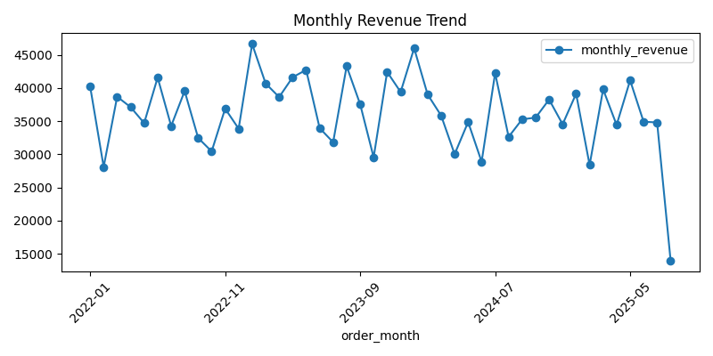

# E-Commerce Insights with SQL & Python

### 📌 Overview
Analyzed an e-commerce dataset using SQL (SQLite) and Python (Pandas).  
Extracted key business insights like total revenue, top products, and monthly trends.

### 🛠️ Tools Used
- **SQLite** – to store and query order data
- **Python + Pandas** – for querying, analysis, and data manipulation

### 🔑 Key Insights
1. **Total Orders:** 10,000  
2. **Total Revenue:** $1,595,831.17  
3. **Top 5 Products by Order Count:**  
   | Product ID | Category      | Order Count |
   |-----------|--------------|-------------|
   | 13        | Grocery      | 34 |
   | 271       | Grocery      | 33 |
   | 475       | Electronics  | 32 |
   | 464       | Electronics  | 31 |
   | 333       | Clothing     | 31 |
4. **Monthly Revenue Trend:**  
  - Stable revenue between Jan 2022 – May 2025  
   - **Noticeable decline after May 2025**, reaching its lowest point in Aug 2025 ($13,986.49)  
   - This drop may indicate **seasonal effects** or a **downturn in sales** 📉  
5. **Average Order Value:** $159.58

### 📊 Sample Chart

### 📂 Files
- `queries.sql` → contains SQL queries  
- `analysis.ipynb` → Python notebook with queries + results  

### 🌐 Project Type
Data Analysis | SQL | Python

